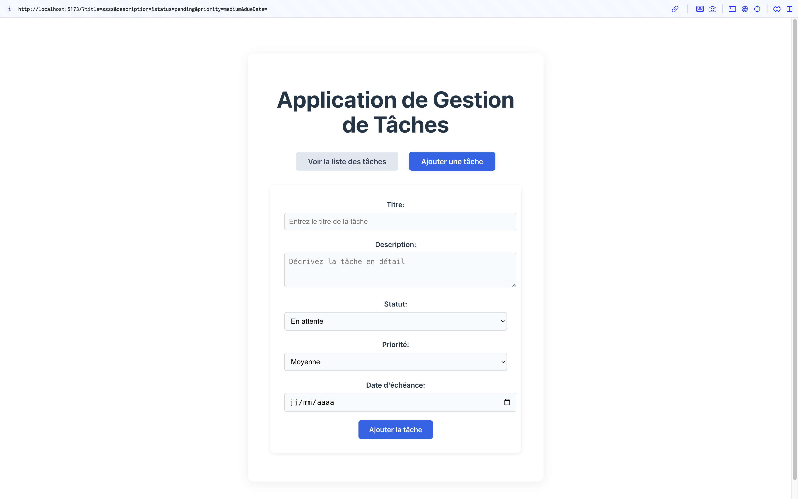

# 🧩 Components Micro-Frontend

# Documentation du micro-frontend de composants React pour la gestion de tâches


[]()
[](./LICENSE)
[]()

---

## ✨ Aperçu visuel

# Captures d'écran des principaux composants de l'application




> *(Ajoutez ici une capture d’écran des composants, par exemple la TodoList ou le formulaire)*

---

## 📦 Description

# Description détaillée du micro-frontend et de ses fonctionnalités

Ce micro-frontend expose une **bibliothèque de composants React réutilisables** pour la gestion de tâches (Todo). Il est conçu pour être intégré dans d’autres applications via **Module Federation** (Vite + vite-plugin-federation).

# Liste des composants disponibles avec leur description

- **Composants fournis** :
  - `TodoItem` : Affiche une tâche individuelle
  - `TodoList` : Liste paginée et filtrable de tâches
  - `TodoForm` : Formulaire d’ajout/édition de tâche
  - `AppTest` : Composant de test pour démonstration locale des composants

# Information sur la gestion des styles

- **Styles** :
  Les composants sont stylisés via un thème partagé (`theme.css`).

---

## 🛠️ Technologies

# Stack technique utilisée dans le projet

| Technologie         | Rôle                                 |
|---------------------|--------------------------------------|
| **React 18+**       | UI Components                        |
| **Vite**            | Bundler & Dev Server                 |
| **vite-plugin-federation** | Module Federation (exposition) |
| **CSS**             | Thème et styles partagés             |

---

## 🧱 Structure du projet

```
Components/
├── src/
│   ├── components/      # Composants réutilisables (TodoItem, TodoList, TodoForm)
│   ├── App.jsx          # Composant principal de l'application
│   ├── main.jsx         # Composant principal de l'application
│   ├── AppTest.jsx      # Composant de test local pour la démonstration
│   └── styles/          # Thème CSS partagé
├── vite.config.js       # Exposition via Module Federation
└── ...
```

> **Note**: Pour tester localement les composants, modifiez le fichier `main.jsx` pour importer `AppTest` au lieu de `App` En remplaçant `import App from './App';` par `import App from './AppTest';`.


---

## 📥 Cloner le projet

```bash
git clone <lien-du-repo-a-renseigner>
cd Components
```

---

## 🚀 Installation & Lancement

```bash
npm install
npm run dev
```

Le micro-frontend sera exposé par défaut sur `http://localhost:5173`.

---

## 🧩 Exposition des composants

Dans `vite.config.js` :

```js
import { federation } from '@originjs/vite-plugin-federation';

export default {
  // ...
  plugins: [
    federation({
      name: 'components_mfe',
      filename: 'remoteEntry.js',
      exposes: {
        './TodoItem': './src/components/TodoItem.jsx',
        './TodoForm': './src/components/TodoForm.jsx',
        './TodoList': './src/components/TodoList.jsx'
      },
      shared: ['react', 'react-dom']
    })
  ]
}
```

---

## 📤 Exemple d’utilisation dans un host

```jsx
// Dans l’application consommatrice (host)
import TodoList from 'components_mfe/TodoList';

function TodosFeature({ todos }) {
  return <TodoList todos={todos} onDelete={...} onEdit={...} ... />;
}
```

---

## 🎨 Thème & Styles

Tous les composants utilisent le fichier `styles/theme.css` pour garantir une cohérence visuelle.  
Vous pouvez surcharger ce thème dans le host si besoin.

---

## ❓ Pourquoi ce micro-frontend ?

- **Réutilisabilité** : partage de composants UI entre plusieurs apps.
- **Indépendance** : évolutions et déploiements séparés de la logique métier.
- **Scalabilité** : chaque équipe peut enrichir la bibliothèque sans impacter le host.

---

## 🤝 Contribution

Les contributions sont les bienvenues !  
Merci de créer une issue claire ou une pull request bien structurée.

---

## 📄 Licence

MIT © 2025 — [Mvondo Fernando]
